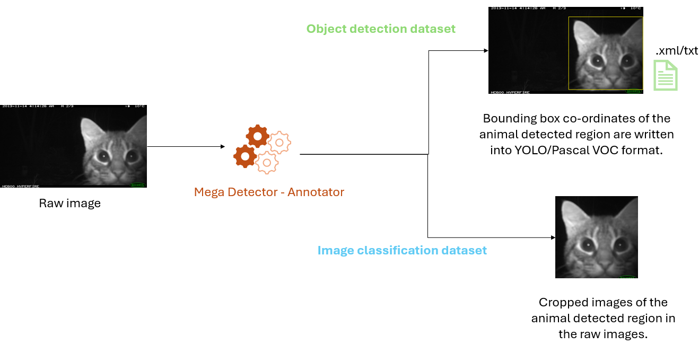
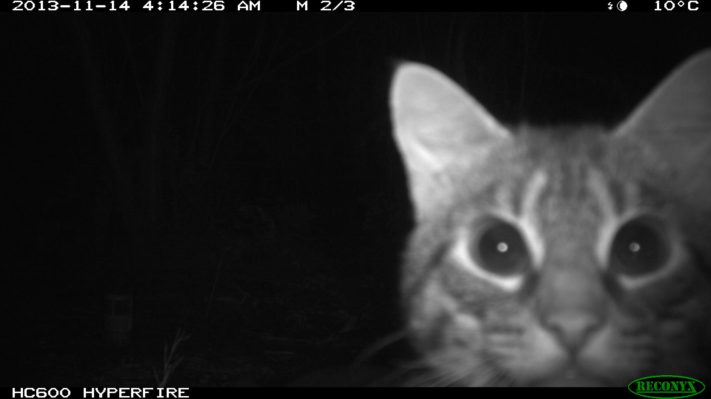

## Process camera trap datasets for training deep learning models



### 1. Environment set-up

Using conda create an environment and install the libraries from the following instructions:

```
conda env create --file environment.yml
conda activate md-annotator
pip install megadetector
```
After the installation, download the mega detector model by clicking the follwoing link: [MegaDetector v5b](https://github.com/agentmorris/MegaDetector/releases/download/v5.0/md_v5b.0.0.pt) and store in the `md_model` directory. For detailed information, you can visit the[MegaDetector User Guide](https://github.com/agentmorris/MegaDetector/blob/main/megadetector.md).

Verify the mega detector installation by running following script:

```
python verify_md_install.py
```



This script performs inference on the above `Cat_Selfie.JPG` image, to detect animal/person/vehicle class and predict the confidence score.
The result in the command prompt should look like below:


This verification can also be performed with the Jupyter notebook (`1_Generate_MD_Crop_Test.ipynb`) and this notebook will generate a cropped part of the animal detected in the image.

If the execution of the above step does not print a SUCCESS message then, please check your installation and fix this issue before proceeding to the next steps.


### 2. Dataset generation